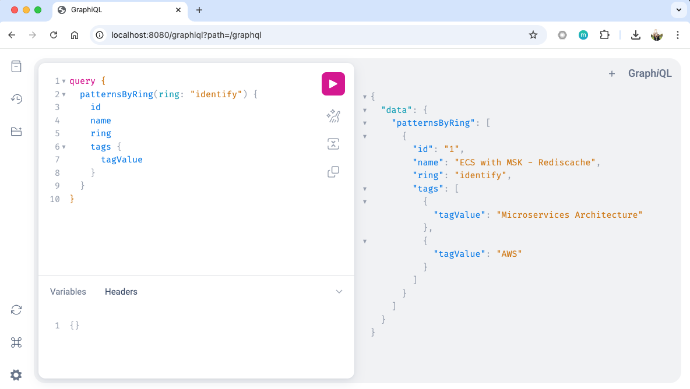

# Spring Boot patterns-solution-service DEMO

A DEMO Spring Boot application demonstrating GraphQL implementation with Spring MVC and JPA, showcasing a pattern management system with H2 database persistence by HawnSolo

## Features

- GraphQL API using Spring MVC
- H2 Database persistence
- Pattern and Tag management with proper entity relationships
- Filtering patterns by quadrant and ring
- CRUD operations for patterns
- Clean separation of models and entities
- GraphiQL interface for testing

## Technology Stack

- Java 21
- Spring Boot 3.2.2
- Spring MVC
- Spring Data JPA
- H2 Database
- GraphQL Spring Boot Starter
- Project Lombok
- JUnit 5

## Architecture

The application follows a clean architecture with proper separation of concerns:

### Models
- Pattern: Data transfer object for GraphQL operations
- Tag: Data transfer object for tag information
- PatternInput: Input type for pattern mutations

### Entities
- PatternEntity: JPA entity for pattern persistence
- TagEntity: JPA entity for tag persistence with proper relationships

### Repositories
- PatternRepository: JPA repository for pattern operations
- TagRepository: JPA repository for tag operations

## Running the Application

1. Clone the repository
2. Build the project: `mvn clean package`
3. Run the application: `mvn spring-boot:run`
4. Access GraphiQL: http://localhost:8080/graphiql
5. Access H2 Console: http://localhost:8080/h2-console

## GraphQL Interface



## GraphQL Schema

### Pattern
```graphql
type Pattern {
    id: ID!
    title: String!
    name: String!
    url: String
    ring: String!
    quadrant: String!
    status: String
    isNew: String
    description: String
    pattern: [String]
    useCase: [String]
    tags: [Tag]
}
```

### Tag
```graphql
type Tag {
    tagId: String!
    tagName: String!
    tagValue: String
    className: String
}
```

## Example Queries

### Get All Patterns
```graphql
query {
  patterns {
    id
    title
    tags {
      tagId
      tagName
    }
  }
}
```

### Get Patterns by Quadrant
```graphql
query {
  patternsByQuadrant(quadrant: "enterprise") {
    id
    title
    quadrant
    ring
    tags {
      tagName
      tagValue
    }
  }
}
```

### Get Patterns by Ring
```graphql
query {
  patternsByRing(ring: "identify") {
    id
    title
    quadrant
    ring
    status
    tags {
      tagName
      tagValue
    }
  }
}
```

### Get Patterns by Phase
```graphql
query {
  patternsByPhase(phase: "development") {
    id
    title
    phase
    status
    tags {
      tagName
      tagValue
    }
  }
}
```

### Get Patterns by Status
```graphql
query {
  patternsByStatus(status: "active") {
    id
    title
    quadrant
    ring
    status
    tags {
      tagName
      tagValue
    }
  }
}
```

### Create Pattern
```graphql
mutation {
  createPattern(pattern: {
    id: "17"
    title: "New Pattern"
    name: "New Pattern"
    ring: "identify"
    quadrant: "enterprise"
    status: "New"
    isNew: "TRUE"
    description: "A new pattern description"
    tags: [{
      tagId: "tag17"
      tagName: "Technology"
      tagValue: "GraphQL"
    }]
  }) {
    id
    title
    tags {
      tagId
      tagName
      tagValue
    }
  }
}
```


## Recent Updates

1. Migrated from WebFlux to Spring MVC
2. Added H2 database persistence
3. Separated models and entities:
   - Created distinct model classes for GraphQL operations
   - Implemented JPA entities for persistence
   - Added proper entity relationships
4. Improved error handling and GraphQL configuration
5. Added comprehensive GraphiQL support for testing

## Testing

The application includes unit tests for:
- GraphQL resolvers
- Service layer
- Repository layer
- Entity relationships

## Contributing

Feel free to submit issues and enhancement requests.